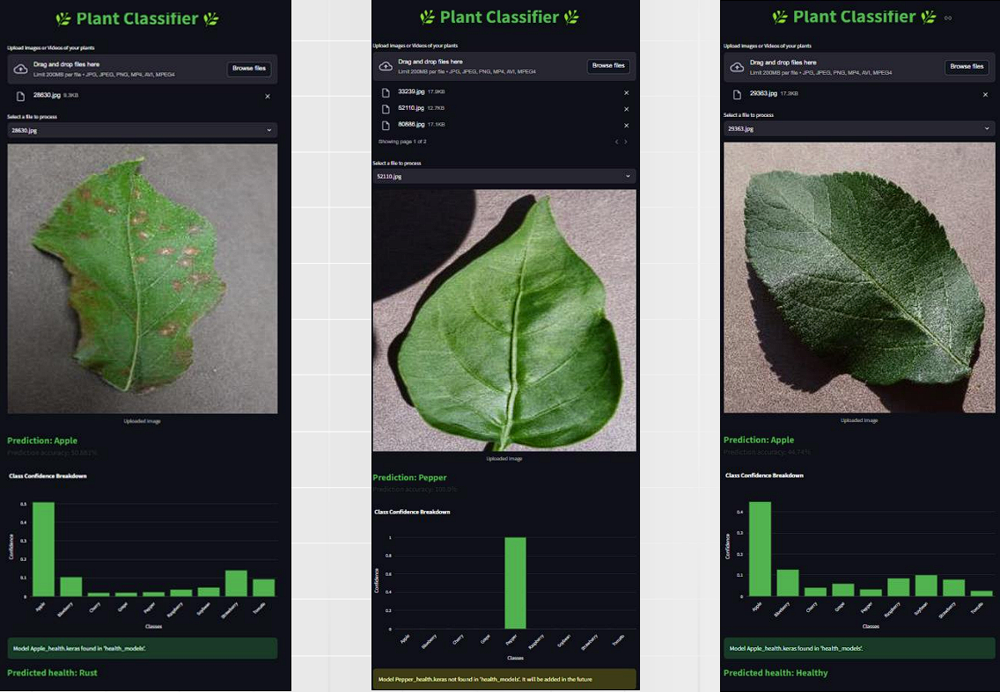

# 🌿 Plant Classifier CNN

**Projekt zaliczeniowy** – Inteligentny system rozpoznawania gatunków roślin oraz diagnostyki chorób liści oparty na głębokich sieciach splotowych (CNN).

---

## 📖 Opis projektu
Aplikacja wykorzystuje uczenie maszynowe, aby pomóc użytkownikom w szybkiej identyfikacji roślin oraz monitorowaniu ich stanu zdrowia. System analizuje przesłane zdjęcie liścia i w czasie rzeczywistym zwraca informację o gatunku oraz ewentualnych jednostkach chorobowych.

### ✨ Główne funkcje
* **Klasyfikacja gatunku:** Automatyczne rozpoznawanie 9 popularnych rodzajów roślin.
* **Detekcja chorób:** Specjalistyczna analiza stanu zdrowia liści (obecnie zoptymalizowana dla jabłoni).
* **Intuicyjny interfejs:** Webowy panel użytkownika typu *drag-and-drop*.
* **Natychmiastowy wynik:** Przetwarzanie obrazu zajmuje zazwyczaj poniżej 2 sekund.

---

## 🛠️ Technologie
* **Deep Learning:** TensorFlow & Keras (Architektura CNN)
* **Backend:** Python
* **Frontend:** Streamlit
* **Przetwarzanie obrazu:** OpenCV

---

## 📂 Obsługiwane rośliny
Model został wytrenowany na zbiorze danych obejmującym następujące rośliny:
`Apple`, `Blueberry`, `Cherry`, `Grape`, `Pepper`, `Raspberry`, `Soybean`, `Strawberry`, `Tomato`.

## Technologie

- **Deep Learning:** TensorFlow/Keras (CNN)
- **Backend:** Python
- **Frontend:** Streamlit

## Screenshot

---

